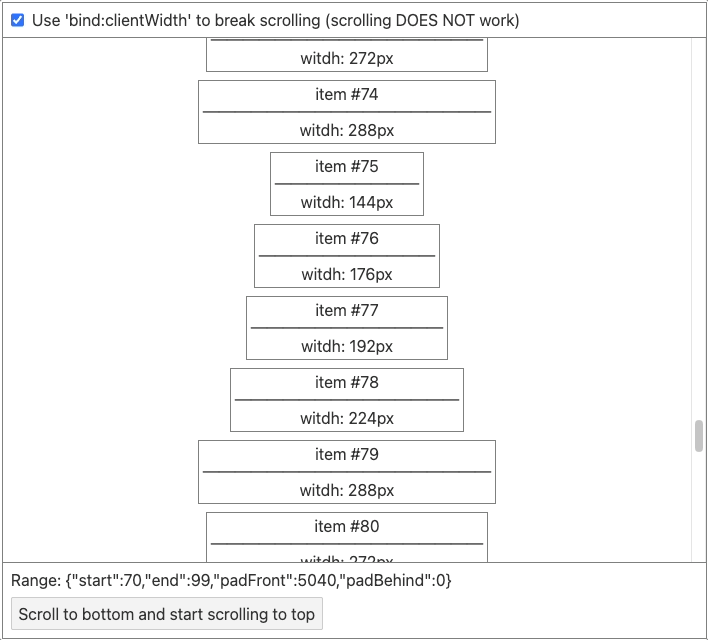

## [svelte-virtual-scroll-list]

[Block-level element bindings] (e.g. `bind:clientWidth`) breaks scrolling.

#### Reproduce with [demo].

Reproduced in Chrome, Opera and Edge (perhaps any Chromium based browser).
It works fine in Firefox and Safari.

[svelte-virtual-scroll-list]: https://github.com/v1ack/svelte-virtual-scroll-list
[Block-level element bindings]: https://svelte.dev/docs/element-directives#block-level-element-bindings
[demo]: https://eugenegoroschenya.github.io/svelte-virtual-scroll-list-bind-client_width-breaks-scrolling/
